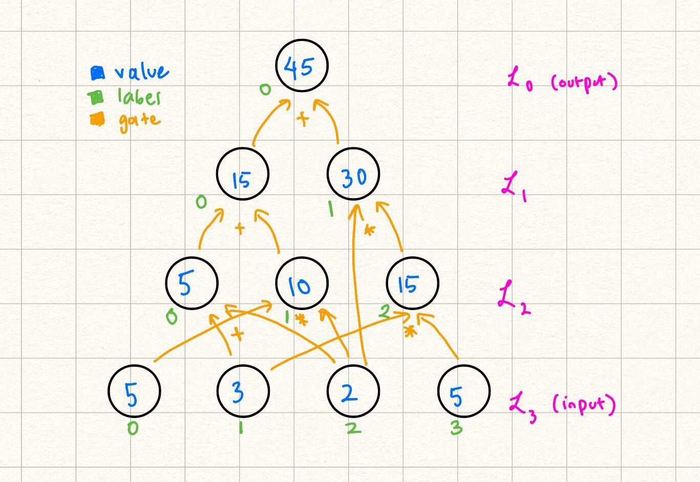
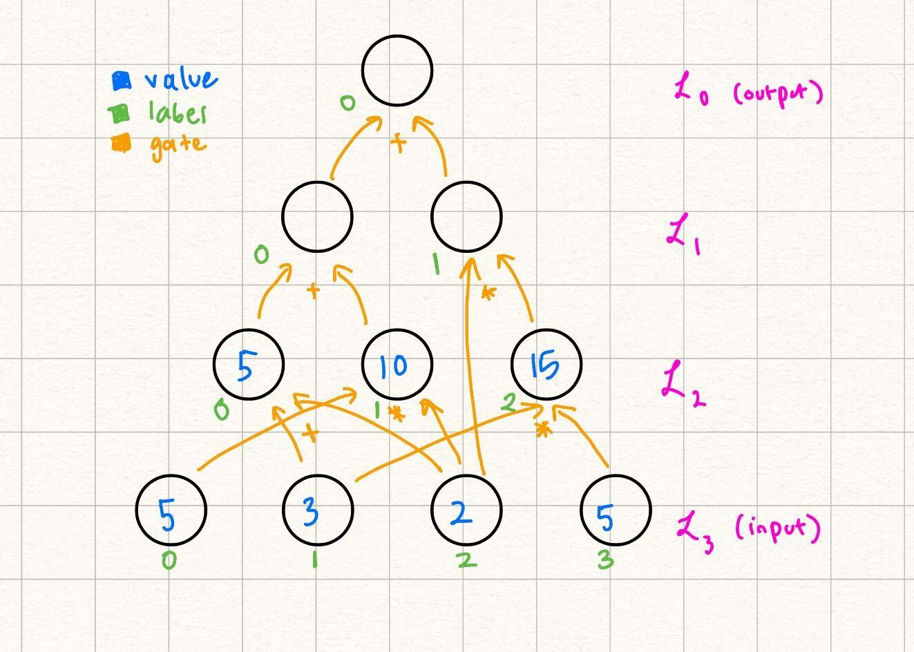

# Encoding Layers in GKR

At this point, we have all the puzzle pieces needed to describe the GKR protocol -- [layered arithmetic circuits](./statement_encoding.md), [multilinear extensions](./multilinear_extensions.md), and [sumcheck](./sumcheck.md). This section talks about how we can tie all of these concepts together to verify claims on the output of an arithmetic circuit.

## Grounding Example

We start with an example layered arithmetic circuit. Throughout this tutorial, we will provide this concrete example while simultaneously providing the generic steps of GKR.

Note some differences from the way this circuit is labeled as opposed to the example in the [statement encoding](./statement_encoding.md) section. Over here, we let the output be a nonzero value for the sake of the example (we explain how to transform any circuit with nonzero output to a circuit with zero output in a [future section](#note-transforming-a-circuit-to-have-zero-output)). Additionally, note that the gate labels start from $0$ in each layer, as opposed to the labels being unique throughout the entire circuit in the previous example. Because our gates $add_{i, j, k}$ and $mul_{i, j, k}$ are unique per triplet of layers $(i, j, k)$, we can start from $0$ in labeling the gates at the start of each layer. 

In this example, $\mathcal{P}$ claims that the output of the following circuit is $45.$ Note that beyond the values in the input, and the actual structure of the circuit (what we refer to as the [circuit description](#circuit-description)), $\mathcal{V}$ does not need any more information to verify the output of the circuit by computation:

This is because every node in every layer $\mathcal{L}_i$ with $i < d$ can be computed as the result of gates applied to nodes in previous layers. 

At a high level, for the rest of this section we focus on encoding layers in two ways: as an MLE of its own, and using its relationship to other layers (via gates). We can equate these two encodings because they are of the same thing (the values in a single layer). With that, we have an equation we can perform a sumcheck over.

## Encoding Layer Nodes as an MLE

We start by encoding the input layer in our example, and then show how this extends to the general case. More concretely, we want an MLE $\widetilde{V}_j(x)$ such that $\widetilde{V}_j(x) = val_j(x).$ Although it might not be immediately evident, because we eventually want to invoke the sumcheck protocol, it is useful to consider the inputs $x$ as bit-strings rather than integral values. 

### Example

Therefore, for example, we want $\widetilde{V}_3(0, 1) = 3$ because $val_3(1) = 3$ and the bit-string $01$ represents $1$. Another way of restating our problem statement of encoding the input layer as some MLE $\widetilde{V}_3(x_1, x_2)$ is to say "when $x = z$, output $val_3(z).$ 

Here we can leverage the power of the [$\widetilde{eq}$ MLE](./multilinear_extensions.md):
$$\widetilde{V}_3(x_1, x_2) = 5(1-x_1)(1-x_2) + 3(1-x_1)x_2 + 2x_1(1-x_2) + 5x_1x_2.$$
You can independently verify that at each of the node input label values, $\widetilde{V}(x)$ outputs the correct value.

### General

Note that we conveniently defined the node labels to start from $0$ and naturally enumerate the nodes in each layer. This allows us to generally extend the function $f(x) = val_i(x)$ which represents the nodes of layer $i$ into the following MLE:
$$\widetilde{V}_i(x) = \sum_{z \in\{0, 1\}^{s_i}}{\widetilde{eq}(x; z)val_i(z)}$$
where $s_i$ is the $\log$ number of nodes in layer $i$.

## Encoding Layers using their Relationship to other Layers

Another note we made when presenting the above diagram was that the only information that $\mathcal{V}$ needs to know immediately is the values of the input itself and the structure of the circuit. This is because the values of the future layers are determined by nodes in previous layers and the gates that connect them. Let's formalize this statement below.

### Example

In the running example, let's fill in the layer $\mathcal{L}_2:$

We were able to fill this in because: 
$$
\begin{align*}
val_2(0) &= &val_3(1) + val_3(2) \\
val_2(1) &= &val_3(0) \cdot val_3(2) \\
val_2(2) &= &val_3(1) \cdot val_3(3)
\end{align*}
$$

So, while one way to write the MLE representing $\mathcal{L}_2$, as explained in the [previous section](#encoding-layer-nodes-as-an-mle), is 
$$
\widetilde{V}_2(x_1, x_2) = 5(1-x_1)(1-x_2) + 10(1-x_1)x_2 + 15x_1(1-x_2),
$$
we can also represent it by its relationship to the nodes in $\mathcal{L}_3:$ 
$$
\begin{align*}
\widetilde{V}_2(x_1, x_2) 
&=& \widetilde{eq}(x_1, x_2; 0, 0)(\widetilde{V}_3(0, 1) + \widetilde{V}_3(1, 0)) \\
&+& \widetilde{eq}(x_1, x_2; 0, 1)(\widetilde{V}_3(0, 0) \cdot \widetilde{V}_3(1, 0)) \\
&+& \widetilde{eq}(x_1, x_2; 1, 0)(\widetilde{V}_3(0, 1) \cdot \widetilde{V}_3(1, 1)).
\end{align*}
$$
Note that in this definition, we still are linear in the variables $x_1, x_2.$

### General
Now we go over how to write $\widetilde{V}_i(x_1, x_2)$ in terms of $\widetilde{V}_j(z)$ for $j > i.$ 
Recall the definition of [$add_{i, j, k}(z, x, y)$ and $mul_{i, j, k}(z, x, y)$](./gkr_tutorial.md/#notation-glossary). For example, in the case of $\mathcal{L}_2$: 
$$
add_{2, 3, 3}((0, 0), (0, 1), (1, 0)) = 1 \\ 
mul_{2, 3, 3}((0, 1), (0, 0), (1, 0)) = 1 \\
mul_{2, 3, 3}((1, 0), (0, 1), (1, 1)) = 1.
$$

If we use the indicator functions $add$ and $mul$ to translate the example [above](#example-1):
$$
\widetilde{V}_i(x) = \sum_{z \in \{0, 1\}^{s_i}}\sum_{x' \in \{0, 1\}^{s_j}}\sum_{y' \in \{0, 1\}^{s_k}}
\bigg( 
\widetilde{eq}(x; z)
add_{i, j, k}(z, x', y')\big[val_j(x') + val_k(y')\big] \\
+ \quad\widetilde{eq}(x; z)mul_{i, j, k}(z, x', y')\big[val_j(x') \cdot val_k(y')\big] 
    \bigg)
$$ 
where $s_i, s_j, s_k$ are the number of bits needed to represent the node labels of that respective layer.
We know that $val_j(x')$ and $val_k(y')$ can be computed using MLEs for $\mathcal{L}_j$ and $\mathcal{L}_k$, so we can rewrite the above as:
$$
\widetilde{V}_i(x) = \sum_{z \in \{0, 1\}^{s_i}}\sum_{x' \in \{0, 1\}^{s_j}}\sum_{y' \in \{0, 1\}^{s_k}}
\bigg( 
\widetilde{eq}(x; z)
add_{i, j, k}(z, x', y')\big[\widetilde{V}_j(x') + \widetilde{V}_k(y')\big] \\
+ \quad\widetilde{eq}(x; z)mul_{i, j, k}(z, x', y')\big[\widetilde{V}_j(x') \cdot \widetilde{V}_k(y')\big] 
    \bigg).
$$ 
More detail and examples on these indicator gate functions are described in a [future section on Canonical GKR](./canonical_gkr.md).

## Using the Equivalence between Layer Encodings

Now, we have enough information to show how we can reduce claims on one layer to claims on the output of an MLE encoding a later layer.

### Example

### General

## Circuit Description

## Note: Transforming a Circuit to have Zero Output