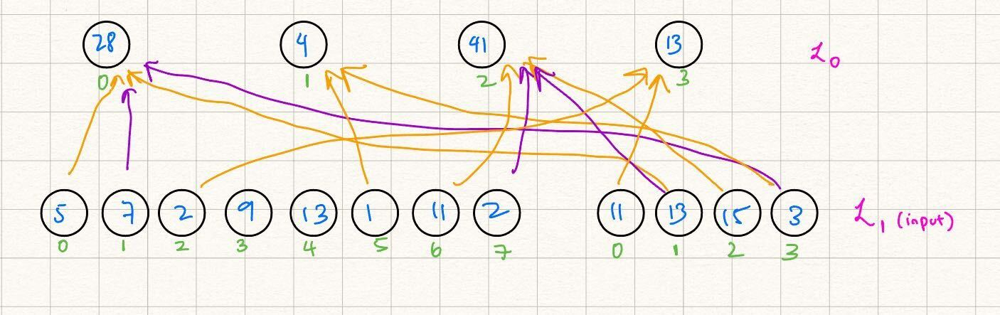
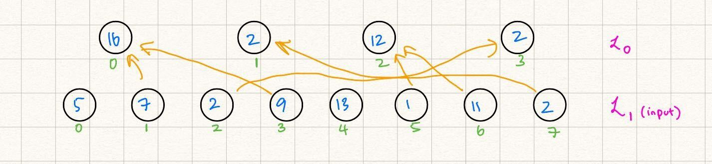
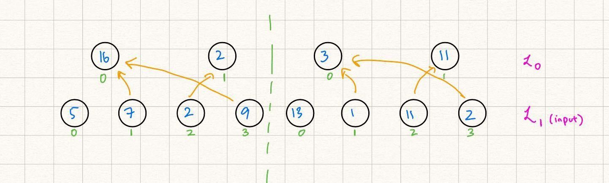

# Gate Frontend Tutorial
We build off of the theory introduction to "gate layers" in GKR, in the [Canonic GKR](../gkr_theory/canonic_gkr.md) section. The following section shows examples on how to create these layers, defined by wirings and the binary operation they denote, in Remainder.

NOTE: The diagrams differ from the circuit (as written in our code example) in one subtle way: we subtract the "expected output" from the output of the gate layer in the code to verify that the circuit computed the correct value. This is equivalent to this section on [transforming a circuit to have zero output](../gkr_background/encoding_layers.md/#note-transforming-a-circuit-to-have-zero-output).

## Example 1: Binary Gate

### Diagram
Let us define the following layerwise relationship, as a small GKR circuit:



### Code
The way we would represent the above diagram as a GKR circuit in Remainder is below, which can also be found in our codebase at [`frontend/examples/binary_gate.rs`](https://github.com/worldcoin/Remainder_CE/blob/v1.0.0/frontend/examples/binary_gate.rs):

```rust
fn build_example_binary_gate_circuit<F: Field>(
    input_num_vars_lhs: usize,
    input_num_vars_rhs: usize,
    wiring: Vec<(u32, u32, u32)>,
    binary_operation: BinaryOperation,
    output_num_vars: usize,
) -> Circuit<F> {
    let mut builder = CircuitBuilder::<F>::new();

    let public = builder.add_input_layer("Public", LayerVisibility::Public);
    // The left-hand side candidates for the input to the binary gate
    let lhs_input = builder.add_input_shred("LHS candidates for binary gate", input_num_vars_lhs, &public);
    // The right-hand side candidates for the input to the binary gate
    let rhs_input = builder.add_input_shred("RHS candidates for binary gate", input_num_vars_rhs, &public);
    // The expected output of the gate operation
    let expected_output = builder.add_input_shred("Expected output", output_num_vars, &public);

  
    let gate_result = builder.add_gate_node(&lhs_input, &rhs_input, wiring, binary_operation, None);
   
    let output = builder.add_sector(gate_result - expected_output);
    builder.set_output(&output);

    builder.build().unwrap()
}

#[test]
pub fn binary_gate_example() {
    const LHS_NUM_VARS: usize = 3;
    const RHS_NUM_VARS: usize = 2;
    const OUTPUT_NUM_VARS: usize = 2;

    // Example inputs to the gate function
    let lhs_mle: MultilinearExtension<Fr> = vec![5, 7, 2, 9, 13, 1, 11, 2].into();
    let rhs_mle: MultilinearExtension<Fr> = vec![11, 13, 15, 3].into();
    // Example wiring
    let wiring = vec![
        (0, 0, 1), 
        (0, 1, 3),
        (1, 5, 3),
        (2, 6, 2),
        (2, 7, 1),
        (3, 2, 0),
    ];
    let expected_output_mle: MultilinearExtension<Fr> = vec![28, 4, 41, 13].into();


    // Create circuit description
    let mut prover_circuit =
        build_example_binary_gate_circuit::<Fr>(LHS_NUM_VARS, RHS_NUM_VARS, wiring, BinaryOperation::Add, OUTPUT_NUM_VARS);
    let mut verifier_circuit = prover_circuit.clone();

    prover_circuit.set_input("LHS candidates for binary gate", lhs_mle.clone());
    prover_circuit.set_input("RHS candidates for binary gate", rhs_mle.clone());
    prover_circuit.set_input("Expected output", expected_output_mle.clone());

    let provable_circuit = prover_circuit.finalize().unwrap();

    // Prove the circuit
    let (proof_config, proof_as_transcript) =
        prove_circuit_with_runtime_optimized_config::<Fr, PoseidonSponge<Fr>>(&provable_circuit);

    // Create verifier circuit description and attach inputs.
    verifier_circuit.set_input("LHS candidates for binary gate", lhs_mle);
    verifier_circuit.set_input("RHS candidates for binary gate", rhs_mle);
    verifier_circuit.set_input("Expected output", expected_output_mle);

    let (verifiable_circuit, predetermined_public_inputs) =
        verifier_circuit.gen_verifiable_circuit().unwrap();
    verify_circuit_with_proof_config(
        &verifiable_circuit,
        predetermined_public_inputs,
        &proof_config,
        proof_as_transcript,
    );
}
```

## Example 2: Identity Gate

### Diagram
Let us define the following layerwise relationship, as a small GKR circuit:



### Code
The way we would represent the above diagram as a GKR circuit in Remainder is below, which can also be found in our codebase at [`frontend/examples/identity_gate.rs`](https://github.com/worldcoin/Remainder_CE/blob/v1.0.0/frontend/examples/identity_gate.rs):

```rust
fn build_example_identity_gate_circuit<F: Field>(
    source_num_vars: usize,
    wiring: Vec<(u32, u32)>,
    output_num_vars: usize,
) -> Circuit<F> {
    let mut builder = CircuitBuilder::<F>::new();

    let public = builder.add_input_layer("Public", LayerVisibility::Public);
    // The MLE that we are routing via the wiring
    let source = builder.add_input_shred("Source for identity gate", source_num_vars, &public);
    // Expected result of the wiring
    let expected_output = builder.add_input_shred("Expected output", output_num_vars, &public);
    
    let gate_result = builder.add_identity_gate_node(&source, wiring, output_num_vars, None);
   
    let output = builder.add_sector(gate_result - expected_output);
    builder.set_output(&output);

    builder.build().unwrap()
}

#[test]
pub fn id_gate_example() {
    const SOURCE_NUM_VARS: usize = 3;
    const OUTPUT_NUM_VARS: usize = 2;

    // The example input MLE.
    let source_mle: MultilinearExtension<Fr> = vec![5, 7, 2, 9, 13, 1, 11, 2].into();
    // Example wiring.
    let wiring = vec![
        (0, 1), 
        (0, 3),
        (1, 7),
        (2, 6),
        (2, 5),
        (3, 2),
    ];
    let expected_output_mle: MultilinearExtension<Fr> = vec![16, 2, 12, 2].into();


    // Create circuit description.
    let mut prover_circuit =
        build_example_identity_gate_circuit::<Fr>(SOURCE_NUM_VARS, wiring, OUTPUT_NUM_VARS);
    let mut verifier_circuit = prover_circuit.clone();

    prover_circuit.set_input("Source for identity gate", source_mle.clone());
    prover_circuit.set_input("Expected output", expected_output_mle.clone());

    let provable_circuit = prover_circuit.finalize().unwrap();

    // Prove the circuit.
    let (proof_config, proof_as_transcript) =
        prove_circuit_with_runtime_optimized_config::<Fr, PoseidonSponge<Fr>>(&provable_circuit);

    // Create verifier circuit description and attach inputs.
    verifier_circuit.set_input("Source for identity gate", source_mle);
    verifier_circuit.set_input("Expected output", expected_output_mle);

    let (verifiable_circuit, predetermined_public_inputs) =
        verifier_circuit.gen_verifiable_circuit().unwrap();
    verify_circuit_with_proof_config(
        &verifiable_circuit,
        predetermined_public_inputs,
        &proof_config,
        proof_as_transcript,
    );
}
```

## Example 3: Dataparallel Binary Gate

### Diagram
Let us define the following layerwise relationship, as a small GKR circuit:


### Code
The way we would represent the above diagram as a GKR circuit in Remainder is below, which can also be found in our codebase at [`frontend/examples/binary_gate_dataparallel.rs`](https://github.com/worldcoin/Remainder_CE/blob/v1.0.0/frontend/examples/binary_gate_dataparallel.rs):


```rust

fn build_example_binary_gate_circuit_dataparallel<F: Field>(
    num_dataparallel_vars: usize,
    input_num_vars_lhs: usize,
    input_num_vars_rhs: usize,
    wiring: Vec<(u32, u32, u32)>,
    binary_operation: BinaryOperation,
    output_num_vars: usize,
) -> Circuit<F> {
    let mut builder = CircuitBuilder::<F>::new();

    let public = builder.add_input_layer("Public", LayerVisibility::Public);
    // The input candidates for the left-hand side of the gate
    let lhs_input = builder.add_input_shred("LHS candidates for binary gate", input_num_vars_lhs, &public);
    // The input candidates for the right-hand side of the gate
    let rhs_input = builder.add_input_shred("RHS candidates for binary gate", input_num_vars_rhs, &public);
    // The expected output of the gate operation
    let expected_output = builder.add_input_shred("Expected output", output_num_vars, &public);

  
    let gate_result = builder.add_gate_node(&lhs_input, &rhs_input, wiring, binary_operation, Some(num_dataparallel_vars));
   
    let output = builder.add_sector(gate_result - expected_output);
    builder.set_output(&output);

    builder.build().unwrap()
}

#[test]
pub fn binary_gate_dataparallel_example() {
    const NUM_DATAPARALLEL_VARS: usize = 1;
    const LHS_NUM_VARS: usize = 3;
    const RHS_NUM_VARS: usize = 2;
    const OUTPUT_NUM_VARS: usize = 2;

    // Example inputs
    let lhs_mle: MultilinearExtension<Fr> = vec![5, 7, 2, 9, 13, 1, 11, 2].into();
    let rhs_mle: MultilinearExtension<Fr> = vec![11, 13, 15, 3].into();
    // Example wiring: Is repeated across (1 << [NUM_DATAPARALLEL_VARS]) copies of the circuit
    let wiring = vec![
        (0, 0, 1), 
        (0, 3, 0),
        (1, 2, 1),
    ];
    let expected_output_mle: MultilinearExtension<Fr> = vec![38, 15, 33, 14].into();


    // Create circuit description
    let mut prover_circuit =
        build_example_binary_gate_circuit_dataparallel::<Fr>(NUM_DATAPARALLEL_VARS, LHS_NUM_VARS, RHS_NUM_VARS, wiring, BinaryOperation::Add, OUTPUT_NUM_VARS);
    let mut verifier_circuit = prover_circuit.clone();

    prover_circuit.set_input("LHS candidates for binary gate", lhs_mle.clone());
    prover_circuit.set_input("RHS candidates for binary gate", rhs_mle.clone());
    prover_circuit.set_input("Expected output", expected_output_mle.clone());

    let provable_circuit = prover_circuit.finalize().unwrap();

    // Prove the circuit
    let (proof_config, proof_as_transcript) =
        prove_circuit_with_runtime_optimized_config::<Fr, PoseidonSponge<Fr>>(&provable_circuit);

    // Create verifier circuit description and attach inputs.
    verifier_circuit.set_input("LHS candidates for binary gate", lhs_mle);
    verifier_circuit.set_input("RHS candidates for binary gate", rhs_mle);
    verifier_circuit.set_input("Expected output", expected_output_mle);

    let (verifiable_circuit, predetermined_public_inputs) =
        verifier_circuit.gen_verifiable_circuit().unwrap();
    verify_circuit_with_proof_config(
        &verifiable_circuit,
        predetermined_public_inputs,
        &proof_config,
        proof_as_transcript,
    );
}

```

## Example 4: Dataparallel Identity Gate

### Diagram
Let us define the following layerwise relationship, as a small GKR circuit:



### Code
The way we would represent the above diagram as a GKR circuit in Remainder is below, which can also be found in our codebase at [`frontend/examples/identity_gate_dataparallel.rs`](https://github.com/worldcoin/Remainder_CE/blob/v1.0.0/frontend/examples/identity_gate_dataparallel.rs):

```rust
fn build_example_identity_gate_circuit_dataparallel<F: Field>(
    num_dataparallel_vars: usize,
    source_num_vars: usize,
    wiring: Vec<(u32, u32)>,
    output_num_vars: usize,
) -> Circuit<F> {
    let mut builder = CircuitBuilder::<F>::new();

    let public = builder.add_input_layer("Public", LayerVisibility::Public);
    // The MLE that we are routing via the wiring
    let source = builder.add_input_shred("Source for identity gate", source_num_vars, &public);
    // Expected routing result from the wiring
    let expected_output = builder.add_input_shred("Expected output", output_num_vars, &public);
    
    let gate_result = builder.add_identity_gate_node(&source, wiring, output_num_vars, Some(num_dataparallel_vars));
   
    let output = builder.add_sector(gate_result - expected_output);
    builder.set_output(&output);
    
    builder.build().unwrap()
}

#[test]
pub fn id_gate_dataparallel_example() {
    const NUM_DATAPARALLEL_VARS: usize = 1;
    const SOURCE_NUM_VARS: usize = 3;
    const OUTPUT_NUM_VARS: usize = 2;

    // Example input
    let source_mle: MultilinearExtension<Fr> = vec![5, 7, 2, 9, 13, 1, 11, 2].into();
    // Example wiring. This is repeated across (1 << [NUM_DATAPARALLEL_VARS]) copies of the circuit.
    let wiring = vec![
        (0, 1), 
        (0, 3),
        (1, 2),
    ];
    let expected_output_mle: MultilinearExtension<Fr> = vec![16, 2, 3, 11].into();


    // Create circuit description
    let mut prover_circuit =
        build_example_identity_gate_circuit_dataparallel::<Fr>(NUM_DATAPARALLEL_VARS, SOURCE_NUM_VARS, wiring, OUTPUT_NUM_VARS);
    let mut verifier_circuit = prover_circuit.clone();

    prover_circuit.set_input("Source for identity gate", source_mle.clone());
    prover_circuit.set_input("Expected output", expected_output_mle.clone());

    let provable_circuit = prover_circuit.finalize().unwrap();

    // Prove the circuit
    let (proof_config, proof_as_transcript) =
        prove_circuit_with_runtime_optimized_config::<Fr, PoseidonSponge<Fr>>(&provable_circuit);

    // Create verifier circuit description and attach inputs.
    verifier_circuit.set_input("Source for identity gate", source_mle);
    verifier_circuit.set_input("Expected output", expected_output_mle);

    let (verifiable_circuit, predetermined_public_inputs) =
        verifier_circuit.gen_verifiable_circuit().unwrap();
    verify_circuit_with_proof_config(
        &verifiable_circuit,
        predetermined_public_inputs,
        &proof_config,
        proof_as_transcript,
    );
}
```