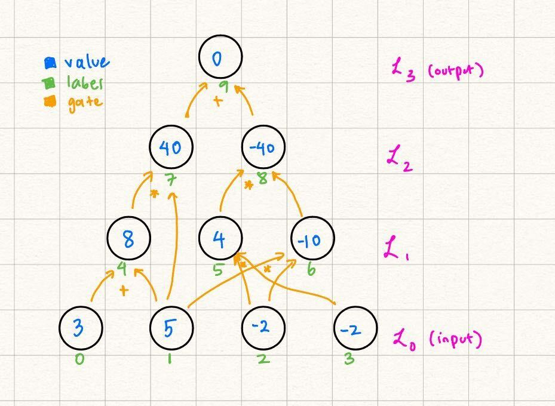

# Statement Encoding

The GKR protocol specifically works with statements of the form $C(y) = 0$, where $C$ is a layered arithmetic circuit. Define a singular node containing $0$ to be the output layer, $\mathcal{L}_d$, and the nodes containing the input values $y_i$ to be the input layer, $\mathcal{L}_0$. 

For any layer, the following invariant holds: if a node belongs in $\mathcal{L}_i$, then it must be the result of a binary operation involving nodes in layers $j, k$ such that $j < i, k < i$. It is possible that $j = k$, but not necessary. 

These binary operations are usually referred to as "gates:" in the following tutorial we will be focusing on two gates: $add$ gates, which are represented by the following function:

$$
    add(z, x, y)= 
\begin{cases}
    1 ,& \text{if } val(x) + val(y) = val(z) \\
    0,              & \text{otherwise}
\end{cases}
$$
and $mul$ gates:
$$
    mul(z, x, y)= 
\begin{cases}
    1 ,& \text{if } val(x) \cdot val(y) = val(z) \\
    0,              & \text{otherwise}
\end{cases}
$$

In other words, if we think of a physical representation of $C$, the _binary gates_ represent the "wires" of the circuit. They show how the values from nodes belonging in previous layers of the circuit can be used to compute the value of the node in a certain layer. In fact, for every node with label $z$ in layer $i \neq 0: \exists \quad\!\!\!\! x, y$ such that $add(z, x, y) = 1$ or $mul(z, x, y) = 1$ for $x, y$ as labels for nodes in layers $j, k < i$.

### Example

Let's look at the following layered arithmetic circuit with depth $d$ = 3:

In this case, $add(4, 0, 1) = 1$ and $mul(4, 0, 1) = 0$, but $mul(7, 4, 1) = 1,$ for example. Notice how the circuit naturally falls in "layers" based on the dependencies of nodes.  